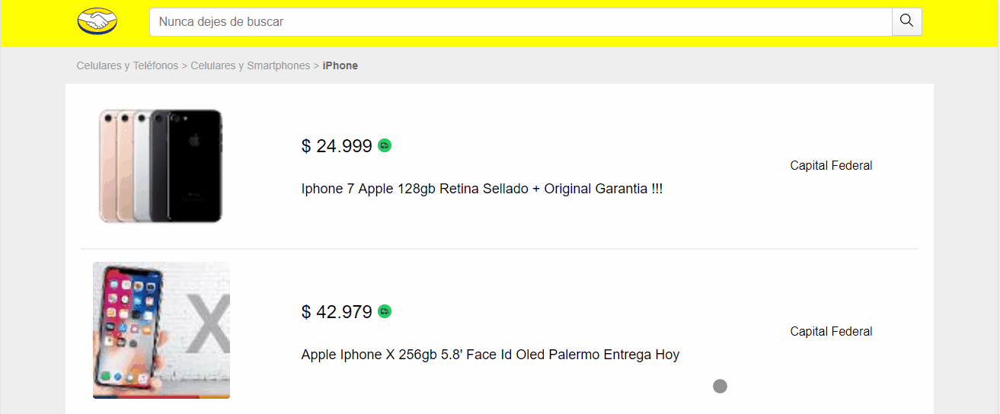
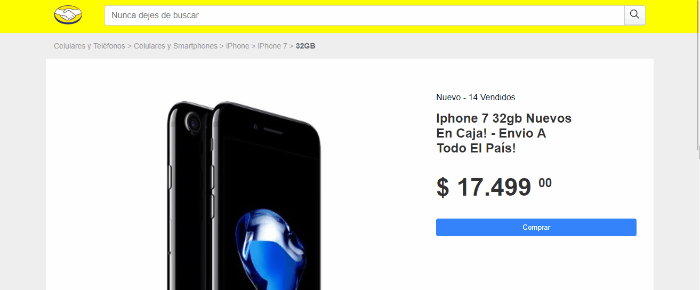

# Mercadolibre Challenge
[Como Iniciar](#como-iniciar)
  - [Setup](#setup)

[Tecnologias](#Tecnologias)
  - [Back end](#back-end)
  - [Front End](#front-end)

[Vistas](#vistas)
  - [Buscar Items](#buscar-items)

  - [Vista Item](#vista-item)


[Comentarios](#comentarios)


## Como Iniciar

### Instalación

Clonarlo:

``` git clone
https://github.com/Guusy/mercadolibreTest
```

Backend:

```
cd backend
npm install
npm run dev
```

Frontend:

```
cd frontend
npm install
npm run dev
```

Ahora la pagina esta corriendo en http://localhost:3000/

## Tecnologias

### Back End
```
NodeJs,Express
```

### Front End
```
React,Next,Sass
```

## Vistas

### Buscar Items

> 

### Vista Item

> 

### Mensajes de error

http://localhost:3000/items?search=asjdiqiod (busqueda invalida)

http://localhost:3000/items/MLA6218270596 (id invalido)

http://localhost:3000/items?search=wq (No se encuentra un filtro que englobe los resultados de la busqueda)

# Comentarios

## SEO:
En la carga de la paginas tanto como en la del item individual y la del buscador hago la llamada a la api de express en ``` getInitialProps() ```
para que esas llamadas se hagan del lado del server, asi cuando google analiza las paginas no les quita puntos por tener que levantar un browser
para poder ver nuestra pagina, esto le agrega tiempo de carga a la pagina pero se usa nada mas para informacion vital que sirve para posicionarse mejor.

## Perfomance:

En cuanto al enrutamiento de Nextjs a los links generados en la busqueda le agrego la opción prefetch ```<Link prefetch>``` para que sus debidos assets y html sean precargados
para que al acceder la carga sea mucho mas rapida y tener un mejor experiencia de usuario.

### Puntos de vista:

``` En la vista de caja de búsqueda, debería poder ingresar el producto a buscar y al enviar el
   formulario navegar a la vista de Resultados de búsqueda, visualizando solo 4 productos. Luego,
   al hacer click sobre uno de ellos, debería navegar a la vista de Detalle de Producto.
```

Este es un requerimiento, el cual pide solo unicamente mostrar 4 productos cuando el usuario realiza una busqueda, se puede conseguir dandole la variable limit=4 a la url ```https://api.mercadolibre.com/sites/MLA/search?q={palabra de busqueda}?&limit=4```

```
Dado un id de producto, debería poder ingresar directamente a la vista de detalle de producto.
```

Este punto se logra agregando una llamada desde la api (express) al entrypoint ```https://api.mercadolibre.com/categories/{id de la categoria}``` asi tambien
podemos obtener las categorias cuando se quiere ver un item especifico y no depende de la navegacion del usuario, por que si bien en el la pagina de busqueda
obtenemos las categorias, la cual podriamos guardar en redux y utilizarlas en la proxima pagina, al hacer esto limitariamos al usuario a tener que hacer este flujo de  navegacion ``` buscar producto -> ver su detalle```,
de esa forma si el usuario quisiera acceder directamente al producto, no tendria disponible la categoria correspondiente, y es por eso que agrego una llamada mas adentro
de la api (express).

## Información extra :

### Resolución de imagenes

En los Specs que se proveen en los archivos del challenge, dice que en la vista de un item especifico la imagen debe tener 680px de ancho, lo adopte como si fuese un requerimiento
que unicamente se cumple cuando estamos un dispositivo desktop, por lo tanto al realice una funcion dentro de la api que busque entre las fotos, la primera que tenga una resolución mayor o
igual a 500px

### El title de la pagina se cambia dinamicamente depende en que pagina estes

*Index = Mercadolibre

*Busqueda de item = Mercadolibre - busqueda de {nombre de lo que se busco}

*Item especifico Mercadolibre - {titulo del item}


